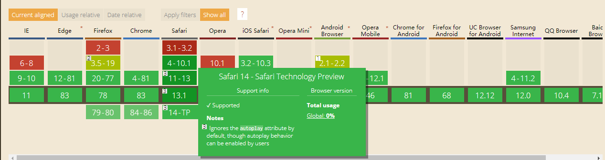
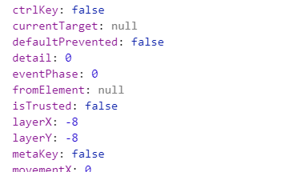
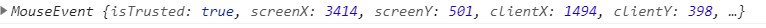

#### 视频自动加载

##### 万恶之源-Chrome
Chrome 对于程序员来说真可谓又爱又恨，爱在他各项兼容性、标准都是最快的;但是恨在他有时候的改变让我们程序员措手不及，就像视频自动播放这件事;

IOS和Chrome现在都是拥有交互才能够进行视频播放，而国内很多的浏览器则是运用FLASH技术，所以还能够播放。

##### 使用VIDEO.JS
我认为这个插件与现在h5的视频元素本质差别不大，也是交互才能播放，而现在大部分得浏览器都支持h5元素得video，因此用处不大


##### 真的能带着声音自动播放吗？网上方法破解
+ muted + autoplay （可）
这种办法就是直接使用H5得`video`元素，设置自动播放后,是不能播放的，但是当你设置了静音之后他就能播放了，测试后发现主流媒体都支持（毕竟只要支持html5标准下的VIDEO元素即可，而且也就IOS、Chrome、Safari搞得这个不静音不能自动播放破玩意）

```html
    <video src="./image/video.mp4" controls autoplay muted></video>
```

+ 模拟用户点击后播放 (不可)
很多人可能会想到既然要点击以后才能自动播放，我们能不能先让他静音播放，然后假装点击，再将静音给关了，曲线达到带着声音的自动播放。那答案是不能的，因为浏览器能够判定你得点击是基于`JS`还是基于点击。
```javascript
    var ev = document.createEvent('MouseEvents');
    ev.initMouseEvent('click', false, true);
    document.getElementById('video').dispatchEvent(ev)
```
上面这是一段用JS模拟点击了浏览器的语句，我们将`ev`打印出来可以看到

里面有个属性`isTrusted`属性是`false`，那我们去MDN查找看看

那我们再打印下鼠标点击事件的输出呢？
```javascript
    document.addEventListener('click', function (ev) {
        console.log(ev)
     })
```

破案了，就是说Chrome对是否是用户点击是依靠这个`isTrusted`属性的，因此我们不能模拟用户进行点击后播放

##### 视频加载完成再播放把
+ buffered + duration
```javascript
    function getBuffered() {
            let timer;

            var update = () => {

                var buffered = document.getElementById('video').buffered
                // buffered.length 缓存的区间
                if (buffered.length) {
                    // buffered.start(0) 第一个缓存开始的区域
                    // buffered.end(0) 第一个缓存结束的区域
                    // 获取当前缓冲进度
                    var loaded = 100 * buffered.end(0) / document.getElementById('video').duration
                    
                    // 渲染缓冲条的样式
                    if (loaded === 100) {
                        clearInterval(timer)
                    }
                }

            }

            timer = setInterval(update, 50)
        }

        getBuffered();
```
通过`buffered`我们能返回一个只读的`TimeRanges`对象，我们能够知道媒体缓冲的区域，但有个问题是现代浏览器其实很大程度来说其实只会加载一小段区域，那么这时候我们就要在进化一下了


+ currentTime + buffered + duration
接上面说到我们`buffered+duration`大法因为现在浏览器智能的仅给我们加载一小段内容，且`buffered` 和`seekable`的大小也不是完全一致的。这时候就有了新的想法,我们在这基础上再加个`currentTime`,让我们的视频不断前进不断缓冲，等到缓冲完后在进行播放
```javascript
    function getBuffered() {
            let timer;

            var update = () => {

                var buffered = document.getElementById('video').buffered
                // buffered.length 缓存的区间
                if (buffered.length) {
                    // buffered.start(0) 第一个缓存开始的区域
                    // buffered.end(0) 第一个缓存结束的区域
                    // 获取当前缓冲进度
                    var loaded = 100 * buffered.end(0) / document.getElementById('video').duration

                    // 改进的步骤
                    video.currentTime = buffered.end(0)

                    // 进度条的加载
            
                    // 渲染缓冲条的样式
                    if (Math.round(buffered.end(0)) >= Math.round(document.getElementById("video").duration)) {

                        clearInterval(timer)
                        video.currentTime = 0
                        // 视频加载完成的操作
                    }
                }

            }

            timer = setInterval(update, 50)
        }

        getBuffered();
```

#### 视频播放进度
添加`timeupdate`事件即可
```javascript
    var id = 1
    video.addEventListener('timeupdate', function () {
        if (Math.floor(video.currentTime) === 10 && id === 1) {
            video.pause()
            document.getElementById('btn1').style.display = 'block'
            id += 1
        }
    })
```